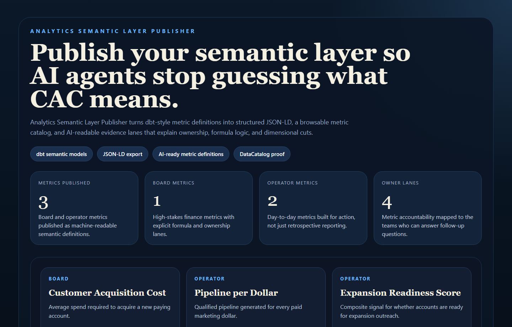
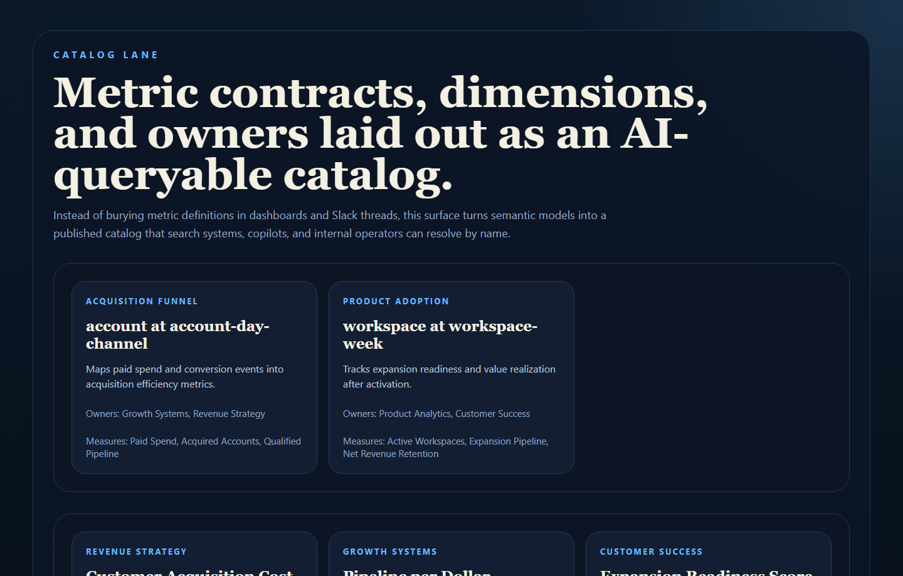
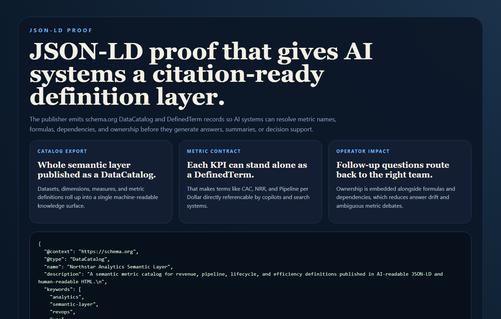
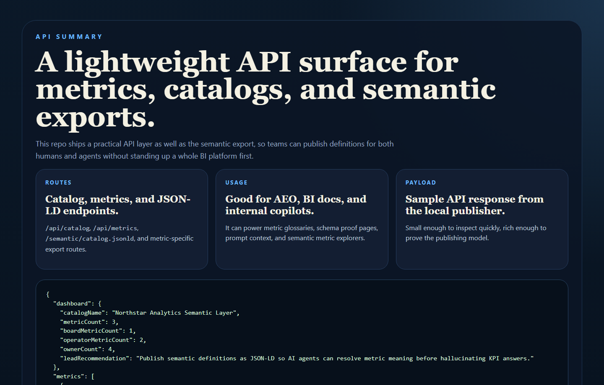

# Analytics Semantic Layer Publisher

Publish a dbt-style semantic layer as structured JSON-LD so AI systems can
query metric definitions by name instead of hallucinating KPI meaning from
dashboard screenshots and half-remembered wiki pages.

## Why This Repo Is Good

- It makes the semantic layer visible outside BI tooling.
- It turns metrics into AI-readable contracts with ownership, formulas, and dependencies.
- It fits the AEO / GEO direction because it publishes structured, citation-friendly metric definitions.
- It gives data teams a proof surface that is both human-readable and machine-readable.

## What It Ships

- FastAPI service for metric, catalog, and JSON-LD routes
- sample dbt-style semantic layer YAML
- Schema.org `DataCatalog` and `DefinedTerm` exports
- HTML proof surfaces for humans
- real PNG screenshots generated from repo-owned HTML scenes
- tests, CI, and one-command local validation

## Screenshots

### Overview



### Catalog Lane



### JSON-LD Proof



### API Summary



## Local Run

```powershell
cd analytics-semantic-layer-publisher
py -3.11 -m venv .venv
.\.venv\Scripts\python.exe -m pip install -r requirements.txt
.\.venv\Scripts\python.exe -m app.main
```

Open:

- [http://127.0.0.1:4604/](http://127.0.0.1:4604/)
- [http://127.0.0.1:4604/catalog](http://127.0.0.1:4604/catalog)
- [http://127.0.0.1:4604/evidence](http://127.0.0.1:4604/evidence)
- [http://127.0.0.1:4604/docs](http://127.0.0.1:4604/docs)

If that port is occupied:

```powershell
$env:PORT = "4608"
.\.venv\Scripts\python.exe -m app.main
```

## Validation

```powershell
cd analytics-semantic-layer-publisher
.\.venv\Scripts\python.exe -m unittest discover -s tests
.\.venv\Scripts\python.exe scripts\run_demo.py
.\.venv\Scripts\python.exe scripts\smoke_check.py
.\.venv\Scripts\python.exe scripts\render_readme_assets.py
```

## Example Metric Definition

```json
{
  "name": "customer_acquisition_cost",
  "label": "Customer Acquisition Cost",
  "type": "ratio",
  "formula": "spend / acquired_accounts",
  "owner": "Revenue Strategy"
}
```

## Example JSON-LD Export

```json
{
  "@context": "https://schema.org",
  "@type": "DefinedTerm",
  "name": "Customer Acquisition Cost",
  "termCode": "customer_acquisition_cost"
}
```

## Repo Layout

- `app/main.py`
- `app/services/semantic_service.py`
- `app/data/sample_semantic_layer.yml`
- `docs/architecture.md`
- `scripts/render_readme_assets.py`

## Why This Matters for AI Search

Most metric definitions live in dashboards, dbt YAML, or tribal knowledge. This
publisher gives AI systems a first-class structured definition layer so they can:

- cite the right metric name
- preserve formula meaning
- understand owners and dependencies
- answer "what does CAC mean here?" with the right contract
